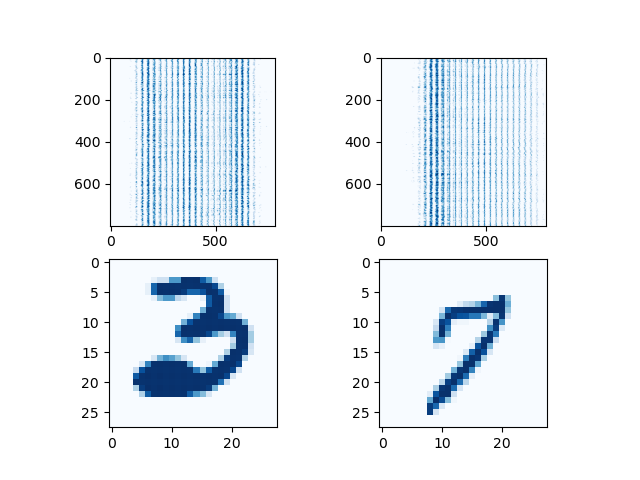
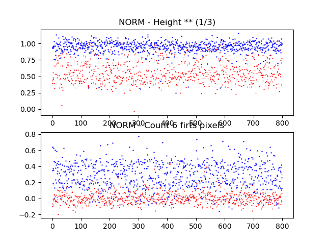
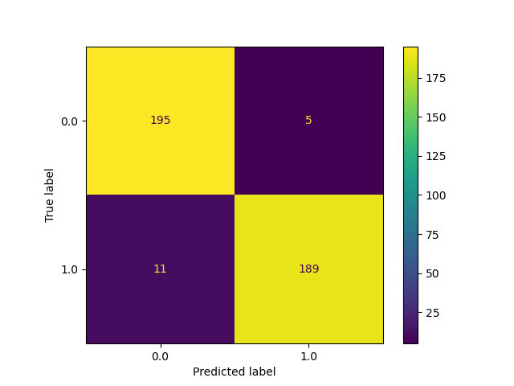

# Pattern recognition (Part 1/4)

#### 👨‍🎓 This project was carried out during my master's degree in computer vision at URJC - Madrid 

The objective of this project is to construct a linear classifier using logistic regression.

The goal is to separate MNIST images representing the numbers 3 and 7.

To do so, only two features (extracted from the images or obtained by feature engineering) will be constructed.

These two single features will then be used to train the classifier.

## Goals

- Construct a linear classifier with only 2 features
- Find the features that will best separate the two types of images
- Have model score (accuracy) >= 0.9

## Requirements

* Python 3.7+


* matplotlib == 3.3.4
* numpy == 1.21.3
* pandas == 1.4.2 
* scikit_learn == 1.1.1


How to install all the requirements :
```bash
$ pip install -r requirements.txt
```

## Usage

Execute only from project directory
```bash
$ python ./src/main.py
```

## Structure

    .
    ├── datasets
    │        ├── 1000_siete.csv
    │        ├── 1000_tres.csv
    │        └── reto1_X.csv
    ├── imgs
    │        ├── Figure_1.png
    │        ├── Figure_2.png
    │        └── Figure_3.png
    ├── model
    │        └── trained_model.sav
    ├── predictions
    │        └── Reto1_Ypred.csv
    ├── README.md
    ├── requirements.txt
    ├── Reto1_2021.pdf
    └── src
        └── main.py

## Examples

These are some examples of the MNIST database



These are the 2 features selected



These are some results of the model (score = 0.9525)



## Authors

* **Luis Rosario** - *Member 1* - [Luisrosario2604](https://github.com/Luisrosario2604)
* **Vicent Gilabert Maño** - *Member 2* - [Vicent](https://github.com/vgilabert94)
